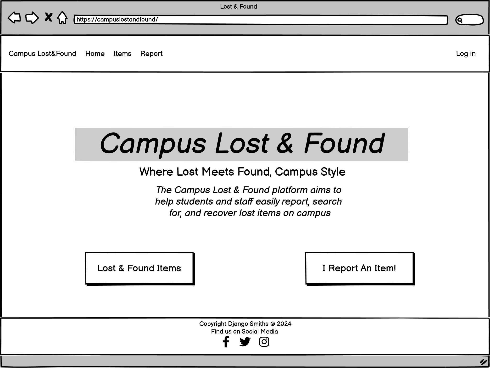

<h1 align="center">Lost and Found</h1>

The Campus Lost & Found platform aims to help students and staff easily report, search for, and recover lost items on campus. The platform streamlines the process of connecting individuals who have lost belongings with those who may have found them, ensuring quick and effective item recovery.

Target Audience:
- Students: Those who have lost items and want to report them or search for found items.
- Finders: Individuals who have found items and want to report them to return to the rightful owner.
- Campus Administration: Admins can monitor reports, moderate activity, and assist in the recovery of valuable or sensitive items.

The page is deployed here: https://campuslostandfound-e8d51102f91c.herokuapp.com/  
The project board is available at: https://github.com/users/Matthieu-Arn/projects/8

Admin Username: CampusAdmin  
Password: u!2tX2cB7

 

## User Experience (UX)

### User Stories

#### User Story: User Account Creation and Authentication

- As a student, I want to create an account so I can report lost or found items.

- Acceptance Criteria:

  1. The user can fill out a form with details about the lost item (description, date, location) and submit it. 

#### User Story: Report Found Item

- As a student, I want to report a lost item so I can try to recover it quickly.

- Acceptance Criteria:

  1. The user can fill out a form with details about the lost item (description, date, location) and submit it.

#### User Story: Report Found Item

- As a student, I want to report a found item so that it can be returned to the owner.

- Acceptance Criteria:

  1. The user can submit details about the found item (item_name, date, location) via a form.
 
#### User Story: Search Lost and Found Items (nice-to-have feature)

- As a student, I want to search for lost or found items so I can see if my lost item has been reported (nice-to-have feature).

- Acceptance Criteria:

  1. The user can search and filter items by keyword.

#### User Story: Item Match Notification (nice-to-have feature ?) 

- As a student, I want to receive a notification when an item matching my lost item description is reported as found, so I can be alerted and take action to recover it (nice-to-have feature).

- Acceptance Criteria:

  1. The user receives an email notification or platform notification when an item with similar characteristics is reported.

#### User Story: Message Finder/Loser

- As a user, I want to message the finder of a reported item so I can coordinate returning the lost item.
  
- Acceptance Criteria:

  1. The user can send and receive private messages to the person who posted a lost or found report.

#### User Story: Mark Item as Recovered

- As a student, I want to mark my lost item as recovered once it has been found, so that the report is updated and no further search or notifications are needed.
  
- Acceptance Criteria:

  1. The user can update the status of their lost item report to “recovered” once they’ve gotten it back.

#### User Story: Admin Moderation

- As an admin, I want to moderate posts so that inappropriate or false reports are removed.

- Acceptance Criteria:

  1. Admins can view, edit, or delete reports to ensure quality control and prevent misuse of the platform.

### Accessibility 

## Design
- Closely matched to LMS material

### Colour Scheme 
 - Earthy Tones, where green represents safety and healing, making it a fitting choice for lost and found services, while cream is warm and inviting, enhancing the user experience.
	Green also rovides a natural feel while still being easy on the eyes.

### Typography
 - Neutral: choice of a Sans-serif font (Roboto) as it is clean and easy to read across various devices and screen sizes.

### Imagery
 - Kept to a minimum, sourced from pixabay.com

### Wireframes
 - Wireframes were created in Balsamiq prior to development, in order to gauge proportions and overall organisations of the pages

### Existing Features 

#### Home Page

- Hero Section: Quick access buttons to "browse items" and "report item" sections

- Navigation Bar: Quick access to all pages on the site and login/logout functionalities

- Footer: Contains links to social media profiles.
  
#### Other pages

- Paginated list of lost/found items (accessible to all)
- Detailed single item page with com ment section (login required)
- Form to report a lost or found item (login required)
- Page summarising user activity (items and messages) (login required)

### Future Features
- Bug fixing
- Improved user feedback when logging in / out

## Data Models

### Item Model:

### Comment Model:

### User Model:

- The User model is provided by Django.

### Relationships:

#### User <-> Item:

- A one-to-many relationship where a user can report multiple items (either lost or found).

- id in the User model references user_id in the Item model.

#### User <-> Comment:

- A one-to-many relationship where a user can post multiple comments, but each comment is associated with only one user.

- 	id in the User model references user_id in the Comment model.

 #### Item <-> Comment:

- A one-to-many relationship where each item can have multiple comments, stored in the comment-content field in the Item model. Each item (identified by item_id) can have multiple comments stored in comment_content.

- id in the Item model references item_id in the Comment model

### ER Diagram

## Technologies Used 

## Agile Methodology 

[Project Board](https://https://github.com/users/Matthieu-Arn/projects/8)

Agile methodology was implemented throughout the development of this project, providing an iterative and flexible approach to software development.

The process was structured using GitHub’s Project Board, which employed a Kanban-style system to manage the user stories and their progress.

## Deployment
  - The site was deployed from the early stages of development using GitHub and Heroku
  - The live site can be found at: https://campuslostandfound-e8d51102f91c.herokuapp.com/

## Testing

Validation yet to be fully implemented

### Validation of HTML, CSS, JS, and Python Code
Validation tools used are [Nu HTML Checker](https://validator.w3.org/nu/), [Jigsaw](https://jigsaw.w3.org/css-validator/), [JSHint](https://jshint.com/), [PEP8 codeInst](https://pep8ci.herokuapp.com) and [Python Syntax Checker](https://extendsclass.com/python-tester.html).

#### HTML Validation

#### CSS Validation

#### Javascript Validation

#### Python Validation

### Manual Testing 

### Responsive Design

### Cross-Browser Compatibility Testing

The website was tested across multiple web browsers, including Chrome, Edge, and Firefox, to ensure cross-browser compatibility. All features, including navigation, user interactions, and responsiveness, performed as expected, with no display or functionality issues observed. This confirms that the website delivers a consistent user experience across these major browsers.

### KNown Bugs
 - Redirection error when logged out and clicking on "Report Item": should direct towards the login/signup page

## Credits 
Picture: pixabay.com

